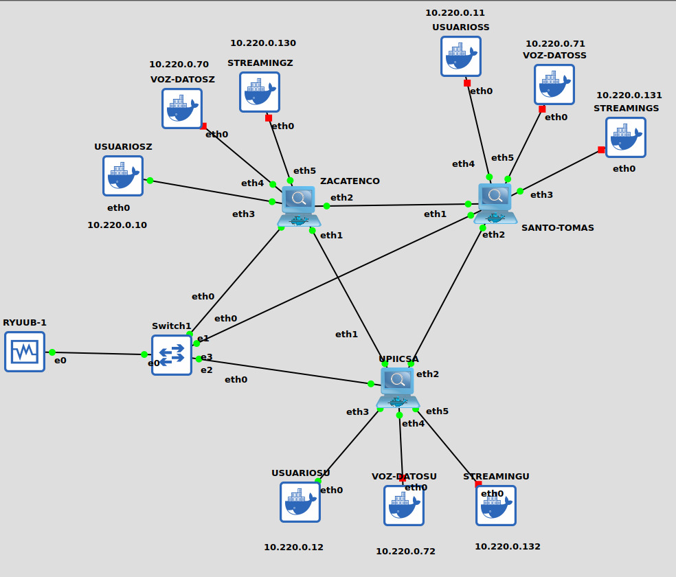
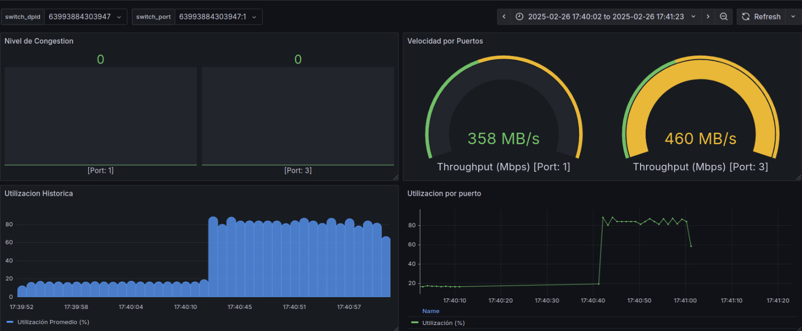

# 🧠 Sistema Inteligente de Gestión en Redes SDN usando Machine Learning

Este proyecto implementa una solución de monitoreo y gestión inteligente para redes definidas por software (SDN), utilizando el framework Ryu y un modelo de Machine Learning entrenado para detectar congestión en tiempo real.

---

## 📌 Características principales

- Captura de métricas de red (delay, jitter, throughput, utilización).
- Análisis de tráfico con algoritmos de ML (Random Forest, KNN, Regresión Logística).
- Visualización de métricas con Grafana.
- Simulación en topologías tipo árbol, mancuerna y delta usando GNS3 y Open vSwitch.

---

## 📁 Estructura del proyecto


---

## 🖼️ Capturas y Diagramas

### 🔌 Topología Delta IPN



### 📊 Ejemplo de dashboard para monitoreo de métricas



---

## ⚙️ Requisitos

- Python 3.8+
- Ryu SDN Framework
- Docker
- GNS3
- MySQL
- joblib, pandas, scikit-learn

🚀 Ejecución del sistema
1. Ejecutar GNS3 y cargar topología
2. Generar tráfico desde host, como los contenedores que se explican aqui y estan disponibles en la carpeta dentro del repositorio
3. Ejecuta la aplicación Ryu.
```bash
ryu-manager ryu_app/metrics.py
```
Ver el documento de el proyecto completo (PDF) para una explicación detallada de la metodología, pruebas y resultados.

